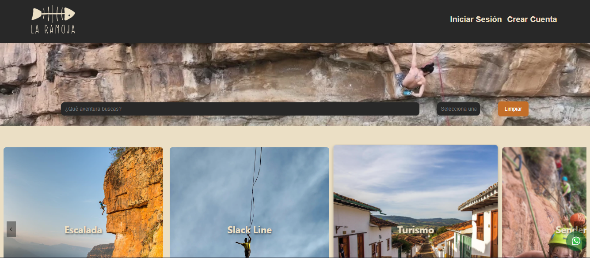

# Proyecto Integrador La Ramoja Tours</H1> 
## Certified Tech Developer - Comisión 4, Equipo 3 

# La Ramoja 🌍✨  
> Plataforma web de turismo y aventuras para descubrir experiencias personalizadas.

## 💡 Descripción

**La Ramoja** es una plataforma web diseñada para los amantes del turismo y la aventura.  
- Descubre experiencias únicas y personalizadas adaptadas a tus preferencias.  
- Encuentra tu plan perfecto con nuestras herramientas avanzadas de búsqueda y recomendación.  
- Explora destinos turísticos y actividades de aventura de manera sencilla y rápida.  

Ya sea que busques una escapada relajante o una experiencia llena de adrenalina, **La Ramoja** tiene algo especial para ti.

---

## ✨ Características

- ✅ Búsqueda de experiencias personalizadas según intereses.  
- ✅ Recomendaciones basadas en destinos y actividades populares.  
- ✅ Interfaz intuitiva para explorar y seleccionar aventuras.  
- ✅ Responsivo para dispositivos móviles.  

---
## ✨ Funciones Principales

La plataforma **La Ramoja** ofrece las siguientes funcionalidades clave:

- **Recomendaciones de tours**: Ofrece opciones personalizadas basadas en los intereses y preferencias del usuario.
- **Compartir tours en redes sociales**: Permite a los usuarios compartir actividades y experiencias en sus plataformas sociales favoritas.
- **Acceso directo a chat de WhatsApp**: Facilita la comunicación con soporte o proveedores de tours a través de un clic.
- **Barra de búsqueda**: Permite encontrar tours y actividades por palabras clave o filtrar por fecha.
- **Registro e Inicio de sesión de usuario**: 
  - Agregar tours a favoritos.
  - Realizar reservas.
  - Acceder al historial de experiencias reservadas.
- **Inicio de sesión de administrador (backoffice)**:
  - Gestión del contenido y las herramientas del sitio.
  - Supervisión de actividades y reservas.

---
## 🛠️ Tecnologías

El proyecto **La Ramoja** está desarrollado con las siguientes tecnologías:

### Frontend
- **React.js**: La estructura del frontend está construida con React.
- **Vite**: Utilizado como entorno de desarrollo rápido y eficiente para construir la aplicación.
- **CSS**: Utilizado para los estilos visuales y media queries.
- **HTML**: Para la estructura base de las vistas.

### Backend
- **Java**: Gran parte del backend fue desarrollado en este lenguaje.
- **Spring Boot**: Uso de Java en un entorno web.
- **Swagger**: Para la documentación y prueba de APIs REST.

### Infraestructura y despliegue
- **Vercel**: Utilizado para el despliegue del frontend.
- **Railway**: Empleado para el despliegue del backend y la documentación Swagger.

### Herramientas adicionales
- **ESLint**: Configurado con reglas para React y recomendaciones generales de código limpio.
- **React Hooks**: Utilizados como parte de las prácticas recomendadas en el desarrollo con React.

---
## 🌍 Vista previa del proyecto

A continuación, una vista previa de la plataforma **La Ramoja**:

---
## 👥 Integrantes
Este proyecto fue desarrollado por:

- Diego Alonso Quintero Moros
- María Alejandra Urrego Roa
- Daniel Mera
- Yaneht Rocío Tellez Lopez
- Julián Salvá Ramírez
- Alejandro Soto
- Fabiana Jannet Torre

> - Deploy Frontend https://ramoja-tours.vercel.app/
> - Documentación Swagger https://ramoja-tours.up.railway.app/swagger-ui/index.html
